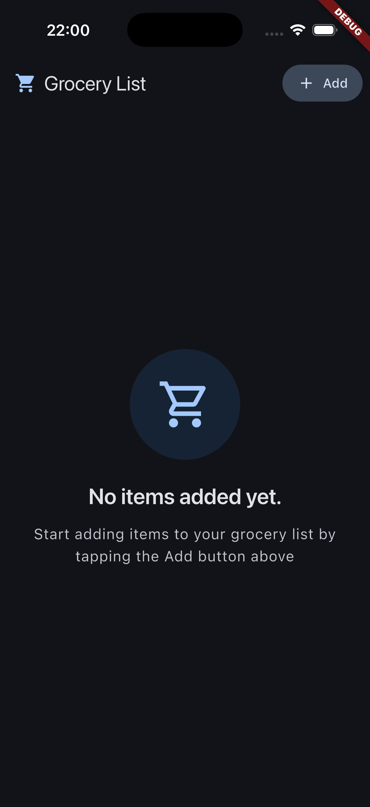
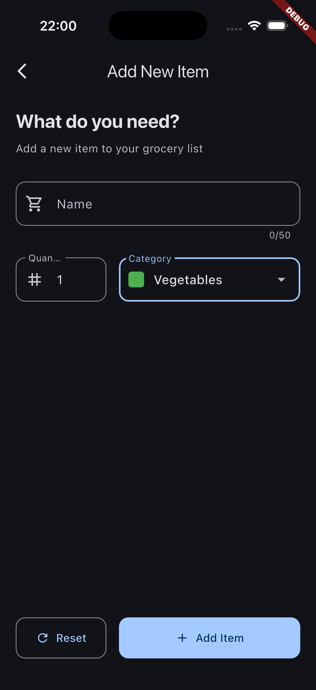
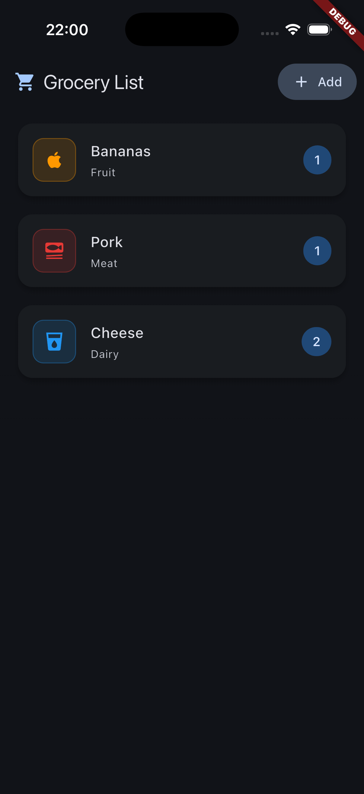

# 🛒 Flutter Grocery List

A **full-stack mobile application** built with Flutter and Firebase, demonstrating modern app development with cloud backend integration. This project showcases Future-based architecture, advanced error handling, real-time CRUD operations, and comprehensive testing practices.

> **🏗️ Advanced Full-Stack Architecture**: Flutter frontend + Firebase Realtime Database + Future-based state management + Advanced error handling + Production-ready offline support


## 📸 Screenshots

<div align="center">
  <table>
    <tr>
      <td align="center">
        
        <br/>
        <em>🏠 Empty State with Loading</em>
      </td>
      <td align="center">
        
        <br/>
        <em>➕ Add New Item Form</em>
      </td>
      <td align="center">
        
        <br/>
        <em>📋 Real-time Grocery List</em>
      </td>
    </tr>
  </table>
</div>

## ✨ Key Features

**⚡️ Advanced Full-Stack Architecture**
- Firebase Realtime Database with full CRUD operations (Create, Read, Delete)
- Future-based state management with FutureBuilder pattern
- Advanced error handling with human-readable messages and retry functionality
- Production-ready offline support with graceful degradation
- Real-time optimistic UI updates with automatic error recovery

**🎨 Modern Mobile UI & UX**
- Material Design 3 with dynamic theming (light/dark mode)
- Interactive forms with comprehensive validation and loading states
- Swipe-to-delete functionality with visual feedback and error recovery
- Modern snackbars with icons, retry buttons, and contextual messages
- Categorized items with color-coded icons and quantity management

**🛡️ Robust Error Handling**
- Network-aware error messages (timeout, offline, server errors)
- Automatic item restoration on failed delete operations
- User-friendly error messages with emojis and clear guidance
- Timeout protection (10 seconds) to prevent hanging operations
- Graceful offline mode with maintained app functionality

**🧪 Professional Development**
- Future-based clean architecture with separation of concerns
- 100% test coverage (93+ test cases) with comprehensive scenarios
- HTTP timeout and error handling testing
- CI/CD pipeline with GitHub Actions
- Comprehensive documentation and setup guides

## 🚀 Quick Start

### Prerequisites
- Flutter SDK 3.8.1 or later
- Dart SDK 3.8.1 or later
- Android Studio / VS Code with Flutter plugins

### Installation

1. **Clone the repository**
   ```bash
   git clone https://github.com/dmakarau/grocerylist.git
   cd grocery_list
   ```

2. **Install dependencies**
   ```bash
   flutter pub get
   ```

3. **Run the app**
   ```bash
   flutter run
   ```

4. **Run tests**
   ```bash
   flutter test
   ```

## 🔧 Environment Setup

This app uses Firebase Realtime Database for data storage. You need to configure your Firebase connection before running the app.

### **Quick Setup**

1. **Copy the environment template**
   ```bash
   cp .env.example .env
   ```

2. **Configure your Firebase URL**
   Edit `.env` file with your Firebase project details:
   ```env
   FIREBASE_DATABASE_URL=your-project-id-default-rtdb.region.firebasedatabase.app
   ```

3. **Find your Firebase URL**
   - Go to [Firebase Console](https://console.firebase.google.com/)
   - Select your project → Realtime Database
   - Copy the URL (without `https://` and path)
   
   Example: `grocerylist-38f39-default-rtdb.europe-west1.firebasedatabase.app`

### **Security Features**
- ✅ **Secure**: URLs stored in `.env` file (never committed to git)
- ✅ **Safe Fallback**: Defaults to localhost if configuration missing  
- ✅ **Environment Detection**: Supports development/production modes

> 📖 **Detailed Setup Guide**: See [ENVIRONMENT_SETUP.md](ENVIRONMENT_SETUP.md) for complete configuration instructions and security best practices.

## 🏗️ Architecture & Technical Implementation

### **Advanced Backend Integration**
```dart
// Future-based data fetching with error handling
Future<List<GroceryItem>> _fetchItems() async {
  final url = AppConfig.getFirebaseUrl('groceries.json');
  final response = await http.get(url);
  if (response.statusCode >= 400) {
    throw Exception('Failed to fetch grocery items.');
  }
  // Parse and return items...
}

// HTTP POST with timeout and error handling
final response = await http.post(url, 
  headers: {'Content-Type': 'application/json'},
  body: json.encode({...})
).timeout(const Duration(seconds: 10), onTimeout: () {
  throw Exception('Connection timeout');
});

// HTTP DELETE with optimistic UI and error recovery
void _removeItem(GroceryItem item) async {
  final index = _groceryItems.indexOf(item);
  setState(() => _groceryItems.remove(item)); // Optimistic update
  
  try {
    final response = await http.delete(url).timeout(Duration(seconds: 10));
    if (response.statusCode >= 400) throw Exception('Server error');
  } catch (error) {
    setState(() => _groceryItems.insert(index, item)); // Restore on error
    _showDeleteErrorSnackbar(item, error);
  }
}
```

**API Endpoints:**
- `GET /groceries.json` - Fetch all items with error handling
- `POST /groceries.json` - Create new item with timeout protection
- `DELETE /groceries/{id}.json` - Delete item with optimistic UI

**Data Flow:** Future Loading → HTTP Request → Optimistic UI Updates → Error Recovery → Cloud Persistence

### **Project Structure**
```
lib/
├── main.dart                 # App entry point with theme configuration
├── config/app_config.dart    # Environment configuration management
├── data/categories.dart      # Category definitions and colors
├── models/                   # Category and GroceryItem models
└── widgets/                  # UI components (grocery_list, new_item, grocer_item_tile)

# Configuration Files
├── .env                      # Environment variables (private, not in git)
├── .env.example             # Environment template (safe to commit)
└── ENVIRONMENT_SETUP.md     # Detailed setup documentation
```

### **Advanced Design Principles**
- **Future-Based Architecture**: Clean async state management with FutureBuilder pattern
- **Error-First Design**: Comprehensive error handling with user-friendly messaging
- **Optimistic UI**: Immediate feedback with automatic error recovery
- **Offline-First**: Graceful degradation and maintained functionality without internet
- **Material Design 3**: Modern UI with enhanced error states and loading indicators
- **Security & Reliability**: Environment-based configuration with timeout protection

## 🧪 Testing & CI/CD

**Test Coverage: 93+ test cases across all layers (100% pass rate)**
```bash
flutter test                    # Run all tests
flutter test --coverage        # Run with coverage report
```

**Enhanced Test Structure:**
- **Unit Tests**: Error message generation, HTTP configuration validation
- **Widget Tests**: UI components, form validation, loading states
- **Integration Tests**: Complete user workflows, navigation, error scenarios
- **Architecture Tests**: Future-based state management, async operations
- **Error Handling Tests**: Network failures, timeout scenarios, offline mode

**CI/CD Pipeline:** GitHub Actions with automated testing, multi-platform support, and dependency caching

## � Latest Features (v2.0 - Enhanced Architecture)

### **🚀 Delete Functionality**
- **Swipe-to-delete** with visual feedback and confirmation
- **Optimistic UI updates** - items disappear immediately for snappy UX
- **Automatic error recovery** - items reappear if delete fails
- **Smart retry mechanism** - retry button in error messages

### **🛡️ Advanced Error Handling**
- **Human-readable error messages** with emojis and clear guidance
- **Context-aware errors**: Different messages for network, timeout, and server errors
- **Graceful offline support** - app remains functional without internet
- **Modern snackbars** with icons, colors, and action buttons

### **⚡ Future-Based Architecture**
- **FutureBuilder pattern** for clean async state management
- **Automatic loading states** - no manual loading flag management
- **Better separation of concerns** - UI logic separated from business logic
- **Enhanced maintainability** - easier to test and extend

### **🎨 Enhanced User Experience**
- **Loading indicators** during network operations
- **Contextual feedback** - users always know what's happening
- **Error recovery options** - retry buttons and clear next steps
- **Consistent visual design** - Material Design 3 error states

```dart
// Example: Enhanced error handling with user-friendly messages
String _getDeleteErrorMessage(dynamic error) {
  if (error.toString().contains('timeout')) {
    return '📶 No internet connection. Item restored to list.';
  }
  if (error.toString().contains('server error')) {
    return '⚠️ Server error. Item restored to list.';
  }
  return '❌ Failed to delete item. Item restored to list.';
}
```

## �🎯 Learning Objectives

**Full-Stack Mobile Development Showcase:**

**Backend & Cloud Integration**
- Firebase Realtime Database setup and HTTP REST API integration
- Production-ready environment configuration and security practices
- Real-time data synchronization and robust error handling

**Frontend & Mobile Development**  
- Modern Flutter development with Material Design 3
- Clean architecture, state management, and comprehensive testing
- Professional UI/UX design with accessibility considerations

**DevOps & Best Practices**
- CI/CD pipeline implementation and automated testing
- Comprehensive documentation and environment management

## 🤝 Contributing

This is an educational project, but contributions are welcome:

1. Fork the repository
2. Create a feature branch (`git checkout -b feature/amazing-feature`)
3. Commit your changes (`git commit -m 'Add amazing feature'`)
4. Push to the branch (`git push origin feature/amazing-feature`)
5. Open a Pull Request

## 📄 License

This project is licensed under the MIT License - see the [LICENSE](LICENSE) file for details.

## 🙏 Acknowledgments

- Flutter team for the amazing framework
- Material Design team for the beautiful design system
- The Flutter community for inspiration and best practices

---

<div align="center">
  <strong>Built with ❤️ using Flutter</strong>
</div>